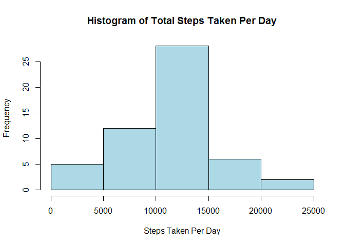
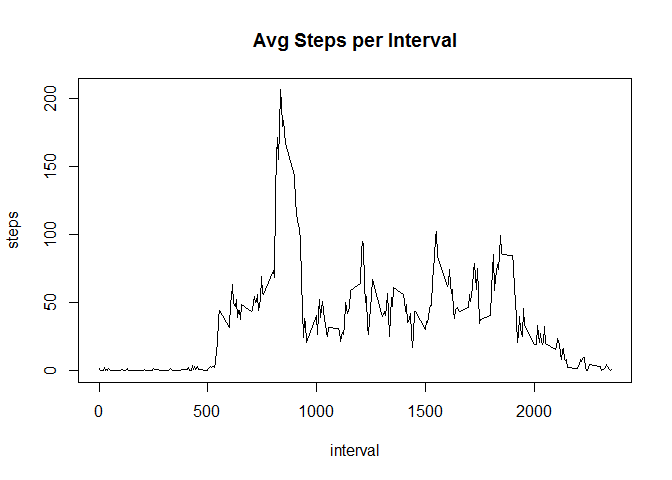
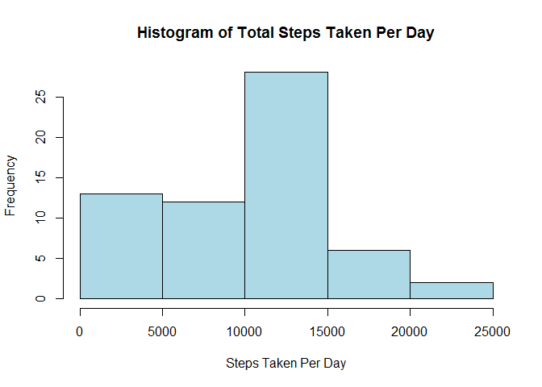
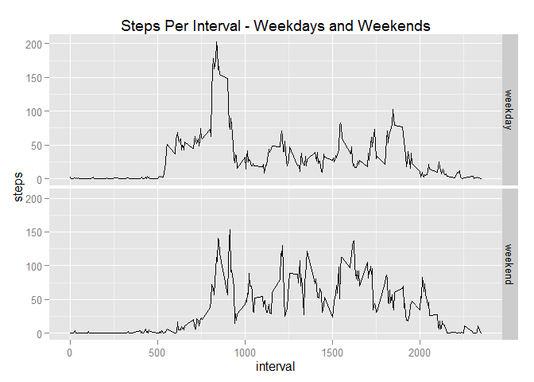

# Reproducible Research: Peer Assessment 1
Sean Miller  
Wednesday, August 05, 2015  

This is a document which will walk you through analyzing data collected from a 
device that monitored the number of steps a person took during  five minute
intervals on different days.


## Loading and preprocessing the data
First, we want to load the data into R and clean out any rows where the number of
steps wasn't recorded.


```r
activity_data = read.csv("activity.csv", header = TRUE)
activity_no_na = na.omit(activity_data)
```

## What is mean total number of steps taken per day?
We want to understand the mean total steps taken per day so we sum the values for
each day and then display those values in a histogram


```r
daily_steps = with(activity_no_na, aggregate(steps ~ date, FUN = sum))
hist(daily_steps$steps, 
     xlab = "Steps Taken Per Day", 
     main = "Histogram of Total Steps Taken Per Day", 
     col = "LightBlue")
```

 


```r
median_data = median(daily_steps$steps)
mean_data = round(mean(daily_steps$steps),2)
```
According to the chart, the mean number of steps taken each day is somewhere between
10000 and 15000 steps.  Using the mean and median functions, we can see that the mean is
10766.19 and the median is 10765.


## What is the average daily activity pattern?
To better understand where the most activity occurs during the course of the day
we can take the average number of steps per five minute interval and display it 
as a line graph.


```r
interval_steps = with(activity_no_na, aggregate(steps ~ interval, FUN = mean))
with(interval_steps, plot(steps ~ interval, 
                          type = "l",
                          main = "Avg Steps per Interval"))
```

 

```r
max_avg_steps = interval_steps$interval[which.max(interval_steps$steps)]
```

The peak of which occurs around the 835th interval.

## Inputing missing values
As part of our first step, we excluded values that were NA, now we want to see
their effect on the data set.


```r
NA_values = sum(is.na(activity_data$steps))
new_data = activity_data
new_data$steps[which(is.na(new_data$steps))] = 0
```

The data set has 2304 NA values in it.  We replace those values with 0 
and then recalculate our median and mean like before.


```r
daily_na_steps = with(new_data, aggregate(steps ~ date, FUN = sum))
hist(daily_na_steps$steps, 
     xlab = "Steps Taken Per Day", 
     main = "Histogram of Total Steps Taken Per Day", 
     col = "LightBlue")
```

 

```r
median_na_data = median(daily_na_steps$steps)
mean_na_data = round(mean(daily_na_steps$steps),2)
```

According to the chart, the mean number of steps taken each day is still between
10000 and 15000 steps.  Using the mean and median functions, we can see that the mean is
9354.23 and the median is 10395.  Both the median and mean value 
of steps per day have been reduced by mapping NA values to 0.

## Are there differences in activity patterns between weekdays and weekends?
We want to compare activity between days during the week and days on the weekend, 
so we add a new column to the data.frame and map that to the value of if the day
was a weekday or weekend.


```r
new_data$DayType = weekdays(as.Date(new_data$date)) %in% c("Saturday", "Sunday")
new_data$DayType = as.factor(new_data$DayType)
levels(new_data$DayType) = c("weekday", "weekend")
```

We then create a line graph to illustrate the difference between the two using the 
ggplot2 library.


```r
library(ggplot2)
week_data = with(new_data, aggregate(steps ~ interval + DayType, FUN = mean))
qplot(interval, 
      steps, 
      data = week_data, 
      facets = DayType ~ . ,
      geom = "line", 
      main = "Steps Per Interval - Weekdays and Weekends")
```

 
